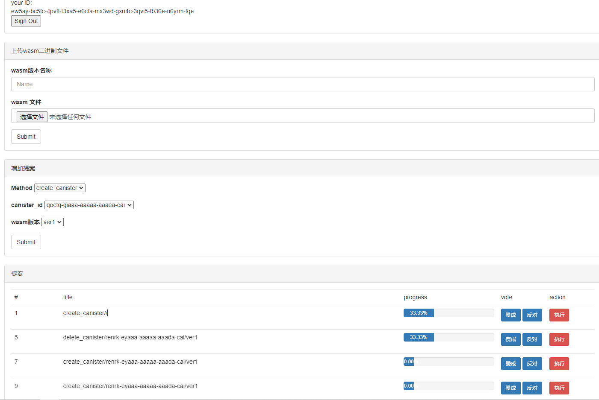

# ic canister management

### 1. deploy
```bash
dfx deploy
```

### 1. upload sample wasm


### 3. install_code > test canister call > stop > delete
```bash
dfx canister call canister_manager install_code '("xxxx-xxxx-xxxx-xxx-cai","ver1")'
dfx canister call xxxx-xxxx-xxxx-xxxx-cai greet '("liu")'
dfx canister call canister_manager stop_canister '("xxxx-xxxx-xxxx-xxx-cai","ver1")'
dfx canister call canister_manager delete_canister '("xxxx-xxxx-xxxx-xxx-cai","ver1")'
```

```bash
dfx canister --wallet=$(dfx identity get-wallet) call canister_manager submit_proposal '("123","upgrade")'
dfx canister --wallet=$(dfx identity get-wallet) call canister_manager get_proposal '(1)'

dfx identity use identity2
dfx canister --wallet=$(dfx identity get-wallet) call canister_manager vote '(1, true)'
```

### 第四课 ：执行截图

